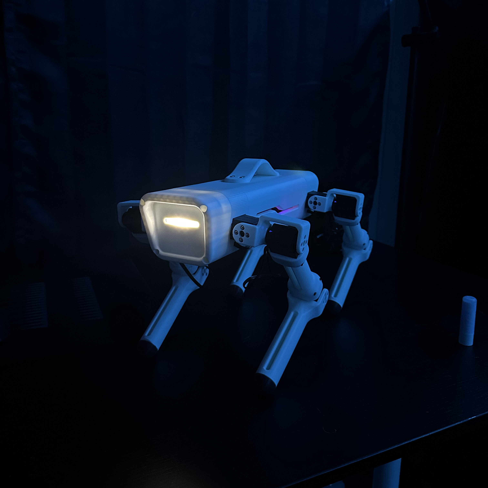

# Swift Quadruped Robot

Welcome to the **Swift Quadruped Robot** project! 
This repository contains all the files and documentation you should need to build, assemble, and program this 3D-printed quadruped. 
This project is designed to be open-source and accessible for robotics enthusiasts.

---

## Project Overview

Swift is a lightweight, and highly functional quadruped robot that can be used for educational purposes, research, or as a stepping stone to more advanced robotics projects. The design combines 3D-printed components, off-the-shelf electronics, and custom firmware to create a versatile and customizable robot.

### Key Features
- Fully 3D-printed body and limb components
- Modular design for easy assembly and customization
- Controlled via ESP32-S3 microcontroller
- Support for advanced gait algorithms and inverse kinematics
- Open-source

---

## Repository Structure

- **`/3D_Models`**: STEP files for 3D printing the robot's parts.
- **`/Firmware`**: Code for controlling the quadruped using an ESP32.
- **`/Media`**: Images and videos.
- **`/Parts_List.xlsx`**: A detailed spreadsheet of all the parts required to build Swift.

---

## Getting Started

### 1. Prerequisites
To get started with this project, you'll need:
- Basic knowledge of 3D printing and electronics
- Access to a 3D printer
- Familiarity with Arduino IDE or PlatformIO

### 2. Required Parts
A detailed list of required components is provided in the [`Parts_List.xlsx`](./Parts_List.xlsx) file.

### 3. Programming
Upload the firmware from the [`/Firmware`](./Firmware) folder to the ESP32 using your preferred development environment. Detailed setup instructions are provided in the firmware folder.

---

## Contact

If you have any questions or need support, feel free to reach out:
- Email: [jacobpsutka2001@gmail.com](mailto:jacobpsutka2001@gmail.com)

---

**Happy Building!**
